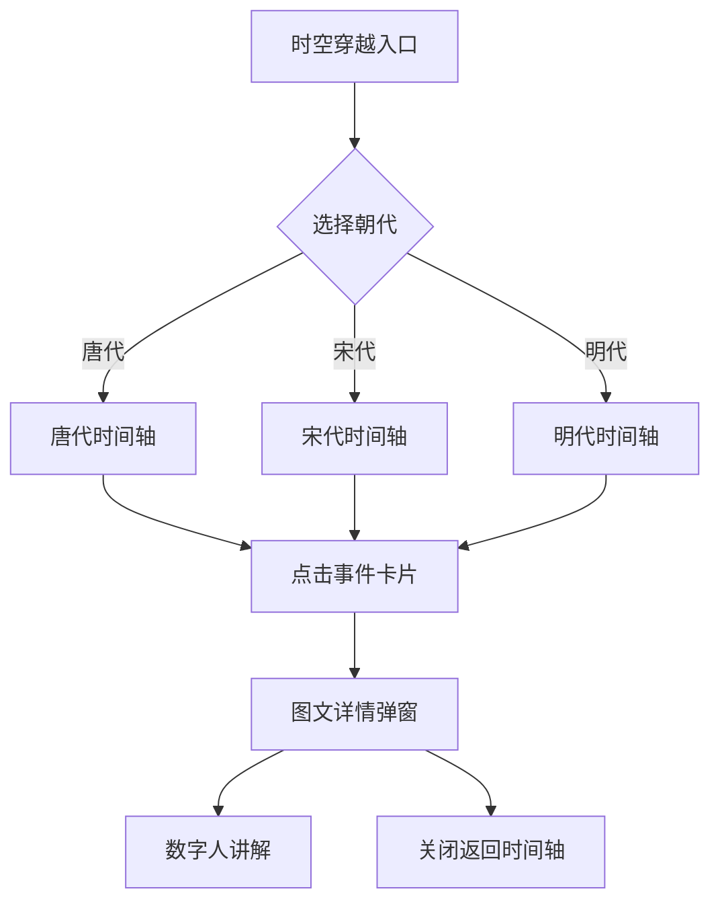

# 时空穿越页面重构方案文档

## 1. 项目概述

### 1.1 背景
当前"时空穿越"历史探索页面功能完整但视觉表现力不足，缺乏历史沉浸感。用户希望重构后能有"眼前一亮"的感觉，并整合丰富的历史图片资源。

### 1.2 目标
- 打造沉浸式朝代穿越体验
- 整合历史图片资源，实现图文并茂
- 增强视觉动效，提升用户参与感
- 支持数字人讲解，增强互动性

### 1.3 范围
- **移动端**（优先）：`software/mobile/app/history/index.tsx`
- **Web 端**（后续）：`frontend/src/pages/tourist/HistoryExplore.tsx`

---

## 2. 现状分析

### 2.1 现有功能
| 功能 | 移动端 | Web 端 |
|------|--------|--------|
| 时间轴展示 | ✅ Hero + Magazine 卡片 | ✅ 垂直时间轴 |
| 朝代筛选 | ✅ 横向 Chip 筛选 | ✅ 胶囊按钮筛选 |
| 那年今日 | ✅ 轮播卡片 | ✅ 静态卡片 |
| 图片展示 | ⚠️ 仅3个景点图 | ❌ 无图片 |
| 数字人讲解 | ✅ VRMManager 集成 | ✅ FloatingGuide |

### 2.2 可用资源
#### 图片资源清单
| 朝代 | 背景图 | 展品图 | 装饰元素 |
|------|--------|--------|----------|
| 唐代 | 7 张 | 18 张 | 印章、标题、水墨 |
| 宋代 | 7 张 | - | 印章、标题 |
| 明代 | 1 张 | 5 张 | 印章、标题 |
| 通用 | - | - | 卷轴、粒子、光效 |

#### 数据结构
```typescript
interface TimelineEvent {
  era: string;        // 朝代
  year: string;       // 年份
  event: string;      // 事件标题
  description: string; // 事件描述
  spot: string;       // 关联景点
}
```

---

## 3. 设计方案

### 3.1 架构设计：沉浸式朝代画廊

```
┌─────────────────────────────────────────────────────────┐
│                    时空穿越入口页                          │
│  ┌─────────┐  ┌─────────┐  ┌─────────┐  ┌─────────┐    │
│  │  唐代   │  │  北宋   │  │  明代   │  │  现代   │    │
│  │ [背景图]│  │ [背景图]│  │ [背景图]│  │ [背景图]│    │
│  └─────────┘  └─────────┘  └─────────┘  └─────────┘    │
└─────────────────────────────────────────────────────────┘
                           ↓
┌─────────────────────────────────────────────────────────┐
│                    朝代时间轴页                          │
│  ┌─────────────────────────────────────────────────┐   │
│  │ [朝代背景图 - 视差滚动]                           │   │
│  └─────────────────────────────────────────────────┘   │
│  ┌─────────┐                                            │
│  │ 时间轴  │  ┌─────────────────────────────────────┐  │
│  │   ●     │  │ [图片] 事件标题                       │  │
│  │   │     │  │        事件描述... [展开]            │  │
│  │   ●     │  └─────────────────────────────────────┘  │
│  │   │     │  ┌─────────────────────────────────────┐  │
│  │   ●     │  │ [图片] 事件标题                       │  │
│  └─────────┘  └─────────────────────────────────────┘  │
└─────────────────────────────────────────────────────────┘
                           ↓
┌─────────────────────────────────────────────────────────┐
│                    图文详情弹窗                            │
│  ┌─────────────────────────────────────────────────┐   │
│  │              [高清大图 - 可缩放]                   │   │
│  └─────────────────────────────────────────────────┘   │
│  事件标题                                                │
│  朝代 · 年份                                             │
│  ─────────────────────────────────────────────────────  │
│  详细文字讲解...                                         │
│  [ 🔊 听数字人讲解 ]                                     │
└─────────────────────────────────────────────────────────┘
```

### 3.2 页面流程



### 3.3 视觉设计

#### 色彩系统
| 朝代 | 主色 | 辅助色 | 应用场景 |
|------|------|--------|----------|
| 唐代 | `#B45309` | `#D97706` | 标题、按钮、边框 |
| 北宋 | `#1E40AF` | `#3B82F6` | 标题、按钮、边框 |
| 明代 | `#DC2626` | `#F87171` | 标题、按钮、边框 |
| 现代 | `#1A5FB4` | `#60A5FA` | 标题、按钮、边框 |

#### 字体规范
- **标题**：书法体 `MaShanZheng`，字号 24-32px
- **正文**：宋体 `Noto Serif SC`，字号 14-16px
- **年份**：加粗，字号 18-20px

#### 动效规范
- **入场**：水墨晕染 400ms
- **切换**：淡入淡出 300ms
- **滚动**：视差背景 跟随滚动
- **点击**：缩放反馈 150ms

---

## 4. 组件设计

### 4.1 EraSelector 朝代选择器
```typescript
interface EraSelectorProps {
  eras: EraTheme[];
  selectedEra: string;
  onSelect: (era: string) => void;
}
```
- 横向滑动卡片列表
- 每张卡片显示朝代背景图
- 选中状态高亮边框

### 4.2 TimelineGallery 时间轴画廊
```typescript
interface TimelineGalleryProps {
  era: string;
  events: TimelineEvent[];
  onEventPress: (event: TimelineEvent) => void;
}
```
- 垂直时间轴布局
- 事件卡片左侧图片，右侧文字
- 支持展开/收起详情

### 4.3 ImageDetailModal 图文详情弹窗
```typescript
interface ImageDetailModalProps {
  visible: boolean;
  event: TimelineEvent | null;
  imageUri: string;
  onClose: () => void;
  onSpeak: () => void;
}
```
- 全屏弹窗，顶部大图
- 底部文字讲解区域
- 数字人讲解按钮

### 4.4 ParallaxBackground 视差背景
```typescript
interface ParallaxBackgroundProps {
  imageUri: string;
  scrollY: Animated.Value;
}
```
- 跟随滚动偏移
- 添加模糊/暗化效果

---

## 5. 数据结构扩展

### 5.1 扩展 TimelineEvent
```typescript
interface TimelineEvent {
  era: string;
  year: string;
  event: string;
  description: string;
  spot: string;
  // 新增字段
  image?: string;           // 事件配图
  detailImages?: string[];  // 详情图集
  audioGuide?: string;      // 讲解音频
}
```

### 5.2 朝代主题配置
```typescript
interface EraTheme {
  name: string;           // 朝代名
  label: string;          // 显示名
  years: string;          // 年份范围
  color: string;          // 主题色
  bgImage: string;        // 背景图
  sealImage: string;      // 印章图
  particleType: string;   // 粒子类型
}
```

---

## 6. 实施计划

### 阶段一：资源准备（1天）
- [ ] 复制图片资源到项目 assets
- [ ] 创建图片映射配置文件
- [ ] 验证图片加载性能

### 阶段二：组件开发（2天）
- [ ] EraSelector 朝代选择器
- [ ] TimelineGallery 时间轴画廊
- [ ] ImageDetailModal 图文详情
- [ ] ParallaxBackground 视差背景

### 阶段三：页面重构（2天）
- [ ] 重构入口页为朝代选择
- [ ] 重构时间轴页
- [ ] 集成图文详情弹窗
- [ ] 集成数字人讲解

### 阶段四：视觉优化（1天）
- [ ] 添加水墨动效
- [ ] 添加粒子特效
- [ ] 优化过渡动画
- [ ] 适配不同屏幕

### 阶段五：测试验证（1天）
- [ ] 功能测试
- [ ] 性能测试
- [ ] 兼容性测试

---

## 7. 技术要点

### 7.1 图片加载优化
- 使用 expo-image 的 `contentFit="cover"`
- 实现图片懒加载
- 添加占位符和加载动画

### 7.2 动效实现
- 使用 react-native-reanimated 实现流畅动画
- 使用 LayoutAnimation 实现展开收起
- 使用 IntersectionObserver 实现滚动触发

### 7.3 性能优化
- 图片预加载朝代背景
- 事件卡片虚拟化（长列表优化）
- 避免不必要的重渲染

---

## 8. 风险评估

| 风险 | 影响 | 缓解措施 |
|------|------|----------|
| 图片资源过大 | 加载慢 | 压缩图片，使用 WebP |
| 动效卡顿 | 体验差 | 使用原生驱动动画 |
| 低端机适配 | 显示异常 | 降级方案，简化动效 |

---

## 9. 验收标准

### 9.1 功能验收
- [ ] 朝代选择正常
- [ ] 时间轴滚动流畅
- [ ] 图片点击可查看详情
- [ ] 数字人讲解正常

### 9.2 视觉验收
- [ ] 朝代背景切换自然
- [ ] 图片清晰无变形
- [ ] 动效流畅无卡顿
- [ ] 整体风格统一

### 9.3 性能验收
- [ ] 首屏加载 < 2s
- [ ] 滚动帧率 > 50fps
- [ ] 内存占用合理

---

## 10. 附录

### 10.1 图片资源映射表
```typescript
const ERA_IMAGES = {
  '唐代': {
    bg: require('@/assets/images/bg-era-tang.png'),
    seal: require('@/assets/images/seal-tang.png'),
    exhibits: [
      require('@/assets/images/exhibit-buddha-face.png'),
      require('@/assets/images/exhibit-dharma-hall.png'),
      // ...
    ]
  },
  // ...
};
```

### 10.2 参考设计
- 故宫博物院 APP 时间轴
- 国家博物馆数字展厅
- 王者荣耀「时之祈愿」活动页
