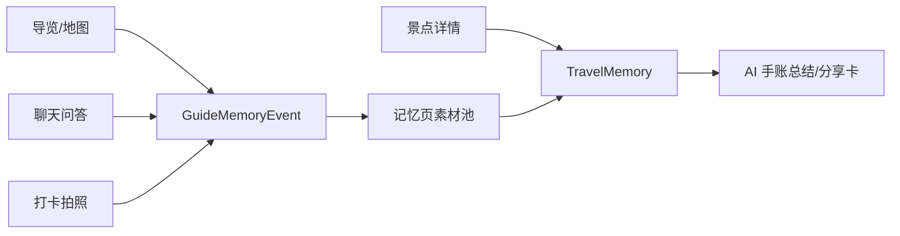

# 旅行记忆图谱设计

## 目标

记忆页不再只是用户手动写下的文字列表，而是把导览、景点、聊天问答、打卡拍照产生的关键事件整理成一条可入册的旅行素材时间线。用户游览时的动作会自动沉淀为“待入册线索”，在记忆页确认后生成正式旅行记忆。

## 第一版范围

- 导览事件：到达景点、播放讲解、路线完成、打卡。
- 聊天问答：数字人回答完成后，将问答片段写入素材池。
- 景点详情：保留现有文字、照片、语音入册能力，并补充来源元数据。
- 记忆页：展示“旅程线索”模块，用户可一键把线索转成正式记忆。
- 后端：`TravelMemory.metadata_json` 保存来源事件、页面、路线、景点等信息，为后续地图回放和手账总结提供关联数据。

## 数据流

## 数据约定

前端统一以 `GuideMemoryEvent` 作为素材来源，并转换成 `MemoryGraphCandidate` 展示。正式保存时将 `source_event_id`、`event_type`、`source_page`、`route_id`、`route_name`、`spot_id`、`spot_name` 写入 `metadata_json`。

`buildMemorySourceMetadata` 负责统一生成来源元数据。聊天问答、导览到达、景点讲解、打卡、路线结束和景点详情直接入册都应通过这套字段携带上下文；候选入册时会保留原始事件 metadata，例如问答来源、打卡距离、照片/语音状态等。

后端 `createMemory` 接收可选的 `spot_id`、`source_type` 和 `metadata_json`，不改变原有手动写记忆流程。

## 验收标准

- 聊天页完成一次问答后，记忆页出现一条问答线索。
- 导览/打卡/讲解事件能以素材卡形式出现在记忆页。
- 用户点击“入册”后打开写记忆弹窗并预填内容。
- 保存后该素材不再重复显示在待入册区。
- 现有手动写记忆、生成总结、记忆列表不回归。
