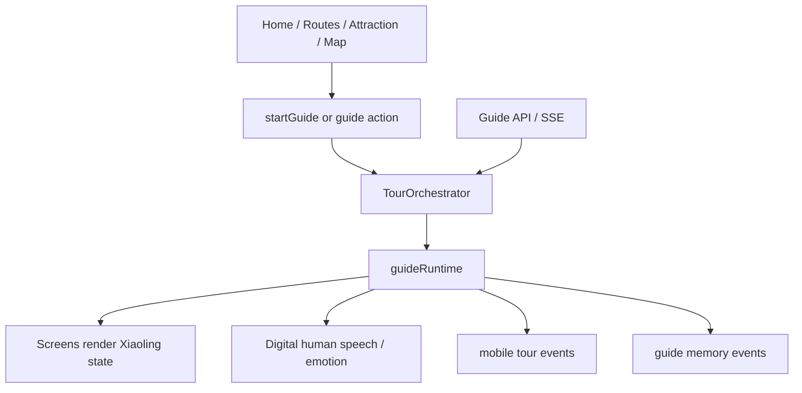

# Digital Human Guide Core Design

Date: 2026-06-23

## Decision

Use one guide core centered on the digital human Xiaoling. Keep two user-facing styles as guide intensity, not as separate products:

- Quiet Companion: the user walks freely, Xiaoling stays present and speaks only at key moments.
- Proactive Guide: Xiaoling plans the route, leads the next step, narrates arrivals, and closes the trip with a summary.

This replaces the current split between `preferences.mode: 'tour' | 'free'`, `soloTour.enabled`, and the separate `SmartGuide/useGuide` flow.

## Product Principle

The app should feel like "Xiaoling is guiding me through Lingshan", not like a scenic spot app with a digital human attached.

Every primary screen must answer one question:

- Home: what does Xiaoling recommend now?
- Routes: which plan does Xiaoling choose for me and why?
- Attraction detail: what does Xiaoling tell me here?
- Map: where is Xiaoling taking me next?
- Memory: what did Xiaoling help me experience?

## Unified Guide Model

Add a single guide mode model inside `software/mobile/hooks/useTourOrchestrator.ts`.

```ts
type GuideMode = 'companion' | 'proactive';
type CompanionLevel = 'quiet' | 'balanced' | 'active';

type GuideStatus =
  | 'idle'
  | 'suggesting'
  | 'navigating'
  | 'arrived'
  | 'narrating'
  | 'free_roam'
  | 'conversing'
  | 'summary';
```

Mapping:

- Current "independent tour" becomes `guideMode: 'companion'`, usually `companionLevel: 'quiet'`.
- Current "active tour" becomes `guideMode: 'proactive'`, usually `companionLevel: 'active'`.
- "Balanced" is the default for users who want Xiaoling present but not pushy.

## State Shape

Keep `TourState` as the single source of truth, but introduce a clearer guide contract:

```ts
interface GuideRuntime {
  mode: GuideMode;
  companionLevel: CompanionLevel;
  status: GuideStatus;
  activeIntent: GuideIntent | null;
  currentRoute: Route | null;
  currentSpot: Spot | null;
  nextSpot: Spot | null;
  prompt: GuidePrompt | null;
  narration: NarrationContent | null;
}
```

Migration rules:

- Keep `currentRoute`, `currentSpot`, `nextSpot`, `progress`, `memoryEvents`, and `guideProfile`.
- Replace UI reads of `preferences.mode` with `guideRuntime.mode`.
- Replace UI reads of `soloTour.enabled` with `guideRuntime.mode === 'companion'` plus `companionLevel`.
- Keep `soloTour` temporarily as a compatibility field during migration, but stop adding new behavior to it.

## Actions

Create one guide entry point:

```ts
startGuide(input: {
  route?: GuideRoute | Route;
  intent?: GuideIntent;
  mode: GuideMode;
  companionLevel?: CompanionLevel;
  sourcePage: string;
})
```

Then redirect current actions:

- `startGuideRoute(route, intent)` calls `startGuide({ route, intent, mode: 'proactive' })`.
- `startSoloTour(intent)` calls `startGuide({ intent, mode: 'companion', companionLevel: 'quiet' })`.
- `switchToFreeMode()` becomes `setGuideMode('companion', 'quiet')`.
- `switchToTourMode()` becomes `setGuideMode('proactive', 'active')`.

Core actions that remain:

- `arriveAtSpot(spot)`
- `startNarration(content)`
- `completeSpot(spot)`
- `continueToNextSpot()`
- `replanFromSpot(spotId)`
- `askXiaoling(text)`
- `finishGuide()`

## Screen Design

### Home

Home becomes the Xiaoling guide console.

Primary first-screen controls:

- "Xiaoling quietly accompanies me"
- "Xiaoling actively leads me"

Show the current guide status if a guide is in progress:

- current route
- current/next spot
- one recommended action

### Routes

Routes become Xiaoling's plans, not a neutral list.

Each route card must show:

- Xiaoling's recommendation reason
- estimated time and energy
- best fit: quiet walk, culture, photo, family, fast visit
- primary action: "Let Xiaoling lead this route"

### Attraction Detail

Attraction detail becomes the main narration surface.

On entry:

- In proactive mode, Xiaoling gives a short arrival line automatically.
- In companion mode, Xiaoling shows a quiet prompt and waits unless arrival context is strong.

Primary actions:

- short intro
- full narration
- ask Xiaoling
- continue to next spot
- record memory/check in

### Map

Map serves the guide flow.

It must highlight:

- user location
- current target
- next spot
- route progress
- Xiaoling prompt for the next movement

Map should not compete as a separate exploration product.

### Memory

Memory becomes the guide recap.

Show:

- route completed or abandoned
- spots visited
- narrations listened to
- questions asked
- memories created
- Xiaoling's next route recommendation

## Component Changes

### `useTourOrchestrator.ts`

This is the guide brain.

Add:

- `guideRuntime`
- `startGuide`
- `setGuideMode`
- `arriveAtSpot`
- `continueToNextSpot`

Deprecate:

- direct UI dependency on `preferences.mode`
- direct UI dependency on `soloTour.enabled`

### `SmartGuide.tsx`

Stop using the separate `useGuide` state as the main guide source.

It should consume `TourContext` and render:

- current Xiaoling prompt
- ask input
- narration state
- quick guide controls

Backend guide SSE can remain as a data source, but it should feed `TourOrchestrator`, not an independent UI state machine.

### `GuidePlanModal.tsx`

Rename choices:

- "Quiet Companion"
- "Proactive Guide"

Both paths call `startGuide`.

### `TourProgressIndicator.tsx`

Rename copy from generic progress to Xiaoling-centered progress:

- "Xiaoling guiding"
- "Next: ..."
- "Continue with Xiaoling"

## Data Flow



The important rule: pages do not invent guide behavior. Pages request guide actions, and the orchestrator decides the resulting state.

## Error Handling

- If backend guide APIs fail, keep local guide behavior using bundled route and spot data.
- If location permission is missing, proactive mode still works as manual step-by-step route guidance.
- If narration audio fails, show text narration and drive Xiaoling with subtitle-only mode.
- If a user rejects prompts repeatedly, lower `companionLevel` for the session instead of hiding Xiaoling completely.

## Analytics

Keep existing event names where possible, but add metadata:

- `guide_mode`
- `companion_level`
- `guide_status`
- `xiaoling_action`

Important events:

- `tour_started`
- `free_explore_started`
- `narration_started`
- `spot_checked_in`
- `route_replanned`
- `tour_ended`
- `memory_created`

## Testing

Unit tests:

- `startGuide` creates equivalent route state for companion and proactive modes.
- `setGuideMode` changes intensity without losing route progress.
- `completeSpot` advances progress and next spot consistently.
- `replanFromSpot` keeps completed spots and creates a valid next route.

Component tests:

- Home shows the two Xiaoling-centered entry actions.
- Attraction detail reads `guideRuntime.mode`, not `preferences.mode`.
- Memory recap appears after `finishGuide`.

Manual QA:

- Start quiet companion, open a spot, verify Xiaoling does not auto-push too aggressively.
- Start proactive guide, complete one spot, verify next spot navigation and narration.
- Switch from proactive to quiet companion mid-route, verify route progress remains.
- Kill and reopen the app, verify guide runtime restores cleanly.

## Rollout Plan

Phase 1: State convergence

- Add `guideRuntime`.
- Add `startGuide` and route old actions through it.
- Keep old fields for compatibility.

Phase 2: UI convergence

- Update Home, Routes, Attraction Detail, Map, and Memory to use Xiaoling-centered language.
- Update `SmartGuide` to consume `TourContext`.

Phase 3: Cleanup

- Remove direct UI checks of `preferences.mode`.
- Retire `soloTour.enabled` from UI logic.
- Convert old copy from "solo/free/active" to "quiet companion/proactive guide".

## Non-Goals

- Do not rebuild the whole visual design in this phase.
- Do not remove backend guide APIs.
- Do not replace route data.
- Do not add a new global state library.
