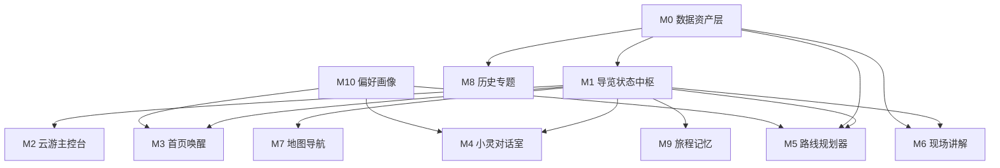

# 移动端数字人导览并行重构方案

## 1. 背景与目标

当前移动端已经有“云游/景点探索”和“记忆”两个较完整的页面，但其他页面中存在较多重复能力：景点列表、路线推荐、地图入口、问答入口、历史内容、打卡与回顾分散在多个页面里，用户看到的是“旅游功能集合”，而不是一个有主线、有陪伴感的数字人导览产品。

本次重构目标是把产品收束成“小灵数字人导览系统”：

- 保留并强化 `software/mobile/app/(tabs)/explore.tsx`：作为“小灵带你游灵山”的导览主控台。
- 保留并强化 `software/mobile/app/(tabs)/memory.tsx`：作为游后记忆、旅程复盘和分享出口。
- 重构其他页面：让它们变成被小灵调用的专业工作流页，而不是重复的功能首页。
- 模块拆分必须互不影响：每个模块有清晰输入输出、可用 mock 数据开发、可独立验收。

最终体验主线：

```text
唤醒小灵 -> 选择导览意图 -> 推荐路线 -> 云游主控台执行导览
-> 地图导航 / 景点讲解 / 对话问答 / 打卡记录
-> 生成旅程记忆
```

## 2. 数据洞察

本方案基于现有三份数据资产：

- `docs/景点景区旅游数据行为分析数据.xlsx`
- `docs/灵山胜境 景点结构化数据集.docx`
- `docs/灵山胜境：历史、文化、景点特色与个性化游览指南.docx`

初步数据结论：

- 行为数据约 14 万条，覆盖 5 万名游客、152 个景点，包含年龄、性别、景点类型、停留时长、消费、同行人数、满意度等字段。
- 典型游客停留中位数约 3.7 小时，平均同行人数约 2.62，人均综合消费约 692.89，平均满意度约 3.72。
- 满意度较高的内容集中在博物馆与展馆、自然公园、历史文化类场景，说明“讲解深度、路线节奏、文化理解”比单纯景点罗列更重要。
- 灵山胜境文档中已经具备结构化景点信息、文化内涵、空间特征和三类路线：历史文化爱好者、自然风光爱好者、亲子家庭路线。

产品策略：

- 不再把“景点、路线、地图、历史、问答”平铺成同级功能。
- 把数据转成小灵可使用的导览脚本、景点知识卡、用户偏好标签和旅程事件。
- 让用户感知到的是“小灵正在带我走”，而不是“我在点很多工具”。

## 3. 页面职责重构

| 页面 | 当前问题 | 重构后职责 | 是否保留主入口 |
|---|---|---|---|
| `(tabs)/explore.tsx` | 已改成导览感较强，应避免继续堆功能 | 小灵导览主控台，承接路线、当前景点、下一站、讲解、打卡、地图跳转 | 保留 |
| `(tabs)/memory.tsx` | 已有旅程记忆方向 | 游后回顾、路线总结、照片/打卡故事、分享卡片 | 保留 |
| `(tabs)/index.tsx` | 容易重复首页功能入口 | 小灵唤醒页：继续导览、今日推荐、意图选择 | 保留但重构 |
| `(tabs)/chat.tsx` | 容易变成通用聊天 | 小灵对话室：围绕当前路线、当前景点和用户偏好问答 | 保留但重构 |
| `(tabs)/profile.tsx` | 账号页价值弱 | 导览偏好和用户画像：节奏、兴趣、预算、讲解深度、家庭/摄影等 | 保留但重构 |
| `routes/index.tsx` | 与探索页重复推荐路线 | 路线规划器：只做路线选择、参数配置和开始导览 | 降级为工作流页 |
| `routes/[id].tsx` | 可能重复景点详情 | 路线脚本详情：站点顺序、时长、讲解重点、适合人群 | 工作流页 |
| `attractions/index.tsx` | 与探索页重复景点列表 | 景点资料库：仅用于搜索、收藏、补充资料，不承担导览主流程 | 次级入口 |
| `attractions/[id].tsx` | 景点详情孤立 | 现场讲解页：讲解、问答、打卡、继续下一站 | 工作流页 |
| `map.tsx` | 容易重复景点浏览 | 导航执行页：当前路线、下一站、偏航提醒、附近讲解 | 工作流页 |
| `history/index.tsx` | 与景点文化内容重复 | 小灵历史讲堂：从景点或对话中被调用的专题内容 | 次级入口 |

## 4. 并行开发总原则

为保证多个同学或多个 agent 并行开发时互不影响，遵守以下原则：

1. 先冻结共享契约，再分别实现页面。
2. 页面之间只通过路由参数、`TourContext`、服务接口通信，不直接 import 彼此组件。
3. 每个模块先用 mock 数据跑通，不等待后端或其他页面完成。
4. 只允许 `explore` 作为导览主控台聚合状态，其他页面不重复做“全功能入口”。
5. 每个模块只改自己的文件范围，共享类型统一放在 `types` 或 `context` 下。
6. 任一模块完成后必须能独立验收，不要求所有模块同时完成。

建议建立两个共享文件作为并行边界：

- `software/mobile/types/guide.ts`：导览数据契约。
- `software/mobile/mocks/guide.ts`：并行开发用 mock 数据。

## 5. 共享数据契约

先定义这些最小类型，所有模块围绕它们开发：

```ts
export type GuideIntent =
  | 'history'
  | 'nature'
  | 'family'
  | 'photo'
  | 'quiet'
  | 'budget'
  | 'deep_explain'
  | 'free_walk';

export interface UserGuideProfile {
  userId?: string;
  interests: GuideIntent[];
  pace: 'slow' | 'normal' | 'fast';
  groupType: 'solo' | 'couple' | 'family' | 'group';
  budgetLevel: 'low' | 'medium' | 'high';
  narrationDepth: 'brief' | 'standard' | 'deep';
  autoNarrate: boolean;
}

export interface GuideStop {
  id: string;
  name: string;
  type: string;
  location?: {
    latitude: number;
    longitude: number;
  };
  recommendedStayMinutes: number;
  culturalTags: string[];
  narrationScriptId?: string;
  checkinRequired?: boolean;
}

export interface GuideRoute {
  id: string;
  name: string;
  theme: 'history' | 'nature' | 'family' | 'free';
  durationMinutes: number;
  suitableFor: GuideIntent[];
  stops: GuideStop[];
}

export interface GuideSessionState {
  sessionId: string;
  status: 'idle' | 'planning' | 'navigating' | 'narrating' | 'chatting' | 'completed';
  currentRoute?: GuideRoute;
  currentStopId?: string;
  nextStopId?: string;
  completedStopIds: string[];
  profile: UserGuideProfile;
}

export interface GuideMemoryEvent {
  id: string;
  sessionId: string;
  type: 'start_route' | 'arrive_stop' | 'narration' | 'ask' | 'checkin' | 'finish_route';
  stopId?: string;
  title: string;
  content?: string;
  createdAt: string;
  mediaUri?: string;
}
```

## 6. 并行模块划分

| 模块 | 名称 | 负责范围 | 输入 | 输出 | 主要文件 | 依赖 | 验收标准 |
|---|---|---|---|---|---|---|---|
| M0 | 数据资产层 | 把 xlsx/docx 转成景点知识卡、路线脚本、画像标签 | 三份数据文档 | `GuideStop`、`GuideRoute`、讲解脚本、标签字典 | `software/mobile/constants/scenic.ts`、`software/mobile/data/*`、后端数据脚本 | 无 | 能生成 3 条主题路线、核心景点知识卡和 mock 数据 |
| M1 | 小灵导览状态中枢 | 统一导览状态、路线、当前景点、进度、事件 | M0 mock 或 API | `GuideSessionState`、actions、事件流 | `context/TourContext.tsx`、`hooks/useTourOrchestrator.ts`、`utils/tourProgress.ts` | M0 类型 | 任意页面能读取当前路线、当前景点、下一站和进度 |
| M2 | 云游主控台保留增强 | 保留 `explore`，只做导览总控，不重复资料库 | M1 状态 | 导览执行 UI、跳转 map/spot/chat/memory | `(tabs)/explore.tsx` | M1 mock | 页面能完成“开始路线、当前讲解、下一站、打卡、结束到记忆”闭环 |
| M3 | 首页唤醒页 | 把首页改成小灵唤醒、继续导览、意图选择 | M1 状态、用户画像 | `GuideIntent`、开始导览动作 | `(tabs)/index.tsx` | M1 类型 | 首页不再堆功能卡，能进入 explore 或 routes |
| M4 | 小灵对话室 | 当前景点/路线上下文问答、讲解风格切换 | M1 状态、LLM/Mock | 对话消息、讲解建议、路线调整意图 | `(tabs)/chat.tsx`、`hooks/useGuide.ts`、`hooks/useTTS.ts` | M1 | 对话内容能显示“当前景点上下文”，不是泛聊 |
| M5 | 路线规划器 | 三类路线选择、参数配置、开始导览 | M0 路线、M10 偏好 | `GuideRoute` 选择结果 | `routes/index.tsx`、`routes/[id].tsx` | M0、M1 类型 | 能选择历史/自然/亲子路线并写入当前导览状态 |
| M6 | 现场讲解页 | 单景点讲解、问答、打卡、继续下一站 | 当前 `GuideStop`、讲解脚本 | `GuideMemoryEvent`、下一站动作 | `attractions/[id].tsx` | M0、M1 | 页面围绕“正在这里听小灵讲”设计，不重复路线列表 |
| M7 | 地图导航执行页 | 当前位置、路线轨迹、下一站、偏航提醒 | M1 状态、定位 hook | 导航状态、附近讲解触发 | `map.tsx`、`hooks/useTourGeolocation.ts`、`hooks/useMapSpots.ts` | M1 | 地图只服务当前路线，不做泛浏览首页 |
| M8 | 历史内容专题 | 历史文化专题、从景点/聊天跳入 | M0 文档内容 | 专题卡、扩展讲解 | `history/index.tsx`、`data/history*` | M0 | 能展示灵山大佛、梵宫、九龙灌浴等专题讲解 |
| M9 | 记忆页保留增强 | 游后时间线、打卡、问答摘要、分享卡 | M1 事件、M6 打卡 | 旅程记忆册 | `(tabs)/memory.tsx` | M1 事件，可先 mock | 能按路线生成“我和小灵走过的灵山”回顾 |
| M10 | 偏好与用户画像 | 导览偏好、兴趣、节奏、预算、讲解深度 | 用户输入、行为数据标签 | `UserGuideProfile` | `(tabs)/profile.tsx`、`stores/*` | M1 类型 | 修改偏好后影响首页推荐和路线规划 mock |

## 7. 模块依赖图



并行策略：

- 第 1 组：M0 和 M1 先并行启动，M0 出 mock 数据，M1 出状态契约。
- 第 2 组：M3、M4、M10 可在 M1 类型稳定后并行开发。
- 第 3 组：M5、M6、M7 用 mock `GuideSessionState` 并行开发，不等待真实后端。
- 第 4 组：M2 和 M9 保留现有页面，逐步接入 M1 事件，不大拆。
- 第 5 组：M8 独立处理内容专题，主要依赖 M0 文本整理。

## 8. 推荐实施阶段

### 阶段 A：契约冻结，1 天

目标：先让团队“并行不打架”。

交付：

- `types/guide.ts`
- `mocks/guide.ts`
- 页面职责表确认
- 路由跳转约定确认

验收：

- 所有页面可 import 同一份类型。
- mock 数据能覆盖历史、自然、亲子三条路线。

### 阶段 B：页面去重，2 到 3 天

目标：把重复功能从各页面移除或降级。

交付：

- `index` 改成小灵唤醒页。
- `chat` 改成上下文对话室。
- `profile` 改成导览偏好。
- `routes` 只做路线规划。
- `map` 只做当前路线导航。
- `attractions/[id]` 只做现场讲解。
- `history` 改成专题内容。

验收：

- 除 `explore` 外，没有页面再承担“综合功能首页”角色。
- 每个页面顶部都能回答一个问题：小灵为什么把用户带到这里。

### 阶段 C：导览闭环，2 到 3 天

目标：从开始导览到生成记忆跑通。

交付：

- 首页选择意图后进入路线规划。
- 路线开始后进入 `explore`。
- `explore` 可进入地图、讲解、对话。
- 景点打卡写入 `GuideMemoryEvent`。
- 完成路线后进入 `memory`。

验收：

- 使用 mock 数据也能完整演示 5 分钟数字人导览流程。
- 断网或后端未接入时，移动端仍可演示核心闭环。

### 阶段 D：数据和 AI 接入，3 到 5 天

目标：用真实数据替代 mock。

交付：

- 景点结构化数据入库或本地 JSON 化。
- 行为数据沉淀偏好标签。
- 文档内容转成讲解脚本和问答知识片段。
- 小灵对话接入当前景点和当前路线上下文。

验收：

- 不同偏好能推荐不同路线。
- 当前景点问答能引用灵山胜境文档内容。
- 记忆页能沉淀真实打卡和问答摘要。

## 9. 各模块详细交付边界

### M0 数据资产层

职责：

- 从行为数据中抽取游客画像标签，如历史文化、自然风光、亲子、摄影、预算敏感、深度讲解。
- 从灵山文档中抽取景点卡：名称、位置、文化内涵、空间特征、推荐停留时间、讲解重点。
- 生成三条基础路线：历史文化 6 小时、自然风光 5 小时、亲子家庭 4 小时。

不做：

- 不负责页面 UI。
- 不负责实时导航。
- 不直接决定用户当前状态。

### M1 小灵导览状态中枢

职责：

- 管理当前路线、当前景点、下一站、完成进度、讲解状态、打卡意图。
- 提供统一 actions：`startRoute`、`arriveStop`、`startNarration`、`finishStop`、`createMemoryEvent`、`endRoute`。
- 对外只暴露状态和动作，不暴露页面细节。

不做：

- 不写具体页面样式。
- 不处理长篇内容整理。
- 不直接调用地图 UI。

### M2 云游主控台

职责：

- 成为数字人导览的第一主场。
- 显示小灵状态、当前路线、当前景点、下一站、讲解状态、快捷操作。
- 跳转到地图、现场讲解、对话、记忆页。

不做：

- 不重复景点资料库。
- 不重复路线规划的完整表单。
- 不重复历史专题长文。

### M3 首页唤醒页

职责：

- 回答“今天小灵怎么带你玩”。
- 支持继续上次导览、快速选择意图、进入推荐路线。
- 做轻量 onboarding。

不做：

- 不放完整景点列表。
- 不放完整地图。
- 不放大量功能宫格。

### M4 小灵对话室

职责：

- 围绕当前景点、路线和用户偏好回答问题。
- 支持“讲浅一点、讲深一点、换亲子口吻、帮我改路线”等导览指令。
- 可触发路线调整或跳转景点详情。

不做：

- 不做通用客服。
- 不做与当前导览无关的大而全搜索页。

### M5 路线规划器

职责：

- 根据用户画像和时间预算推荐路线。
- 展示路线站点、时长、强度、讲解重点。
- 开始导览后把路线写入 M1。

不做：

- 不在此页面承担现场讲解。
- 不重复地图导航。

### M6 现场讲解页

职责：

- 围绕一个景点提供沉浸讲解、提问、打卡、继续下一站。
- 显示小灵的当前讲解脚本和文化要点。
- 把打卡、问答、完成事件写入记忆事件。

不做：

- 不做完整景点列表。
- 不做路线规划。

### M7 地图导航执行页

职责：

- 服务当前路线：当前位置、下一站、距离、偏航提醒、附近景点触发。
- 跳转回 `explore` 或进入当前景点讲解。

不做：

- 不做普通地图浏览器。
- 不承载景点资料库。

### M8 历史内容专题

职责：

- 把灵山历史、佛教文化、建筑特色做成可被小灵调用的专题内容。
- 从景点详情或对话中进入。

不做：

- 不作为主 Tab。
- 不重复景点详情页。

### M9 记忆页

职责：

- 保留为游后出口。
- 汇总路线、到访景点、打卡、照片、问答摘要、讲解片段。
- 支持生成分享卡。

不做：

- 不重复实时导览控制。
- 不承担路线开始入口。

### M10 偏好与画像

职责：

- 管理用户导览偏好：兴趣、节奏、同行人、预算、讲解深度、自动讲解。
- 为首页推荐、路线规划、对话风格提供输入。

不做：

- 不做完整数据分析后台。
- 不直接决定页面跳转。

## 10. 路由与调用约定

建议统一使用以下跳转语义：

| 来源 | 动作 | 目标 |
|---|---|---|
| 首页 | 选择导览意图 | `/routes?intent=history` 或 `/routes?intent=family` |
| 路线页 | 开始导览 | 写入 M1 后跳转 `/(tabs)/explore` |
| 云游主控台 | 查看地图 | `/map?mode=current-route` |
| 云游主控台 | 听当前景点 | `/attractions/[id]?from=guide` |
| 云游主控台 | 问小灵 | `/(tabs)/chat?context=current-stop` |
| 现场讲解 | 完成打卡 | 写入 `GuideMemoryEvent` 后返回 `explore` |
| 云游主控台 | 结束导览 | `/(tabs)/memory?sessionId=xxx` |
| 对话页 | 查看历史专题 | `/history?topic=fan-gong` |

## 11. 验收标准

产品验收：

- 用户能明确感知“小灵在带我游灵山”，而不是看到一组孤立工具。
- `explore` 是唯一导览主控台，`memory` 是唯一游后回顾出口。
- 首页、路线、地图、景点、聊天、历史各有单一职责。
- 任意页面都能说明自己处在导览闭环中的哪个阶段。

工程验收：

- 每个模块可以用 mock 数据独立运行。
- 不同模块修改文件范围基本不重叠。
- 共享类型统一，页面之间不直接耦合。
- `npm run lint` 和移动端基本启动检查通过。

演示验收：

1. 打开首页，小灵根据偏好推荐“历史文化路线”。
2. 进入路线页，确认 6 小时路线并开始导览。
3. 回到云游主控台，看到当前站点、下一站和小灵提示。
4. 进入地图页，看到下一站导航。
5. 进入景点讲解页，完成一次讲解和打卡。
6. 进入对话页，询问当前景点文化问题。
7. 结束路线，记忆页生成旅程回顾。

## 12. 风险与边界

| 风险 | 表现 | 处理方式 |
|---|---|---|
| 页面继续重复 | 每个页面又加景点列表、路线卡、聊天入口 | 以页面职责表为准，重复能力只允许作为轻入口 |
| M1 状态膨胀 | 所有业务都塞进 `TourContext` | M1 只存导览过程状态，内容详情仍在数据层 |
| 后端未完成阻塞前端 | 页面等接口无法开发 | 先使用 `mocks/guide.ts`，接口只替换数据源 |
| 记忆事件缺失 | 游后页面无内容 | 从 M6 和 M2 起就写 `GuideMemoryEvent` |
| AI 对话泛化 | 小灵像普通聊天机器人 | 每次对话必须带当前路线、当前景点、用户画像上下文 |

## 13. 建议排期与并行分工

| 时间 | 并行工作 |
|---|---|
| Day 1 | M0 整理 mock 数据；M1 冻结类型和 TourContext actions；其他模块按契约拆页面 TODO |
| Day 2 | M3 首页、M4 对话、M10 偏好并行；M5 路线规划开始接 mock |
| Day 3 | M6 景点讲解、M7 地图执行、M2 主控台接入状态并行 |
| Day 4 | M9 记忆页接事件；M8 历史专题接内容；完成主流程联调 |
| Day 5 | 数据替换、体验打磨、移动端真机验收、演示脚本整理 |

最低可演示版本只需要完成：

- M0 mock 数据
- M1 状态中枢
- M2 云游主控台
- M3 首页唤醒
- M5 路线规划
- M6 单景点讲解
- M9 记忆回顾

地图、历史专题、画像和 AI 对话可以作为增强模块继续并行推进。
